# riscv-cdc-lowpower-soc

**minisoc**: a small RISC-V system-on-chip built to show front-end ASIC design skills:
**clock domain crossing (CDC), multiple power domains, latency and
performance measurement, RTL design in Verilog, and verification in
SystemVerilog.**

It reuses a verified 5-stage RV32I core (`core_p5`, from the author's
earlier TinyTrust project; see [`rtl/core/`](rtl/core)) as a black box, the
way a real SoC integrates CPU IP. All the new work is in what surrounds the core: about 1,300 lines of
RTL (half of it comments explaining why), 750 lines of testbench, and the
scripts that run and check them.

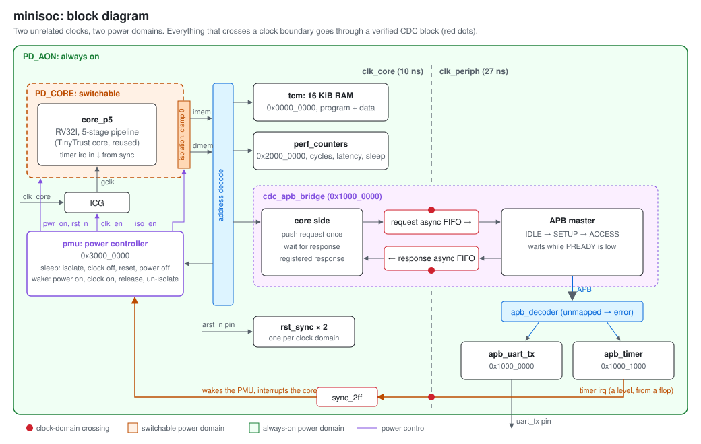

## At a glance

| | |
|---|---|
| **Clocks** | Two unrelated clocks. Exactly three signals cross between them, each through a verified CDC block |
| **Power** | The core is a switchable power domain with isolation, clock gating and a power controller; everything else is always on |
| **Tests** | 11 simulations on Vivado xsim, all passing: CDC blocks, the whole chip at three clock ratios, power-down and wake-up |
| **CDC signoff** | Vivado `report_cdc`: 0 critical findings, after fixing the two real problems it found |
| **Assertions** | FIFO pointer rules, APB protocol, and every power-sequencing rule, checked on every clock |
| **Coverage** | The FIFO test fails unless it has driven the FIFO both full and empty |
| **Tests that fail** | The power and CDC tests were also run against deliberately broken RTL, to show they catch the bug they are aimed at |
| **FPGA stand-in** | Artix-7, after synthesis: 2,162 LUTs, 1,324 flops, 4 block RAMs; core clock meets 15 ns |

## Skills map

| Front-end skill | Where it is |
|---|---|
| CDC design | [`rtl/cdc/`](rtl/cdc): two-flop synchronizer, reset synchronizer, pulse synchronizer, Gray-pointer async FIFO |
| CDC verification | Metastability model in simulation, `report_cdc` with written waivers, `set_max_delay -datapath_only` constraints |
| SoC architecture and data flow | [`rtl/soc/`](rtl/soc): core, RAM, bus decode, a bridge from the core's bus to APB across clock domains |
| Latency and performance analysis | [`perf_counters.v`](rtl/soc/perf_counters.v): hardware counters that measure every crossing; results below |
| Multiple power domains | [`rtl/power/`](rtl/power): power controller, isolation cells, clock gate; [`upf/minisoc.upf`](upf/minisoc.upf) |
| Verification in SystemVerilog | [`dv/`](dv): scoreboards, SVA, covergroups, self-checking tests, programs assembled in SystemVerilog |
| Design automation | [`scripts/`](scripts): regression runner; [`make_waves.py`](scripts/make_waves.py) draws every waveform in this page from the simulations |

## Contents

- [1. Clock domain crossing](#1-clock-domain-crossing)
- [2. The chip: crossing the bus to the peripherals](#2-the-chip-crossing-the-bus-to-the-peripherals)
- [3. Power domains](#3-power-domains)
- [4. How it is verified](#4-how-it-is-verified)
- [5. Results](#5-results)
- [6. Running it](#6-running-it)
- [7. What this does not claim](#7-what-this-does-not-claim)
- [Repository layout](#repository-layout)

---

## 1. Clock domain crossing

| File | What it does |
|---|---|
| [`sync_2ff.v`](rtl/cdc/sync_2ff.v) | Two-flop synchronizer. Optional metastability model for simulation |
| [`rst_sync.v`](rtl/cdc/rst_sync.v) | Reset that asserts immediately (no clock needed) and releases on a clock edge |
| [`pulse_sync.v`](rtl/cdc/pulse_sync.v) | Sends a one-cycle pulse across domains without losing it, with a busy flag |
| [`async_fifo.v`](rtl/cdc/async_fifo.v) | Streams words between two unrelated clocks, using Gray-coded pointers |

### The async FIFO

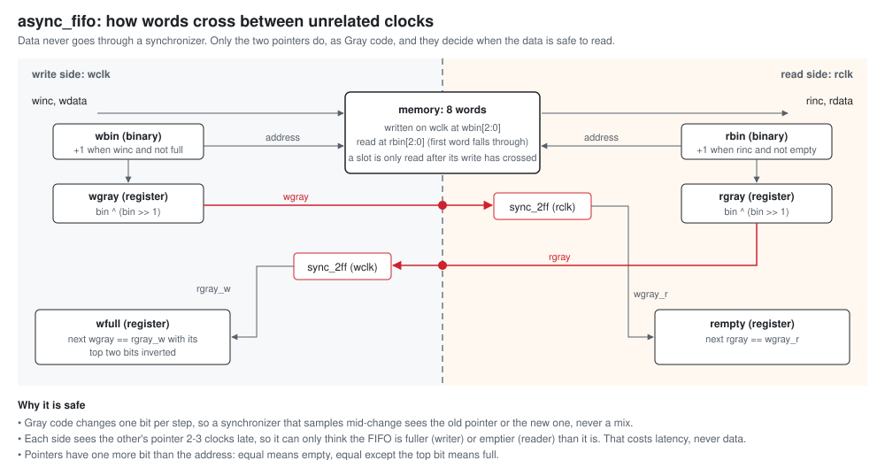

The data itself never goes through a synchronizer. Only the two pointers
cross, and they cross as Gray code, so a synchronizer that samples one in
the middle of a change sees either the old value or the new one. Each side
sees the other's pointer a few clocks late, which can only make it
cautious: the writer may think the FIFO is fuller than it is, the reader
emptier. That costs latency, never data.

One word crossing from a 10 ns clock to a 27 ns clock. The write pointer
moves, reaches the read side through the synchronizer, and only then does
`rempty` fall:

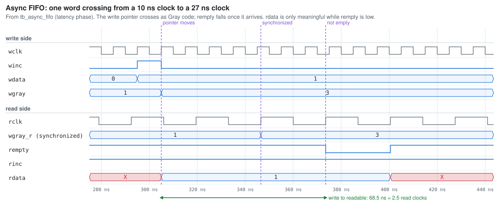

Filling up: the writer runs flat out, the reader is slow. The FIFO reaches
8 words, `wfull` holds the writer off, and nothing is lost:

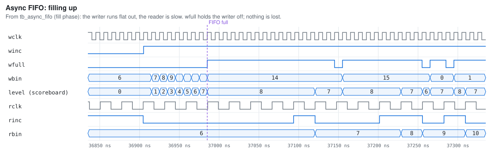

### Why ordinary simulation cannot find CDC bugs

In RTL simulation a flip-flop never goes metastable, so a broken crossing
passes every test. `sync_2ff.v` has a simulation-only model, turned on with
`CDC_META_SIM`: a bit that changes within 1 ns before the clock edge
resolves to its old or its new value at random, independently of the other
bits, as it does in silicon.

With the model on, a 6-bit counter crosses from a 10 ns clock to a 27 ns
clock twice, once as binary and once as Gray code. The binary copy jumps
back from 37 to 35: several bits changed at once, some were caught old and
some new, and the result is neither value. At the same moment the Gray copy
reads 40, which is correct.

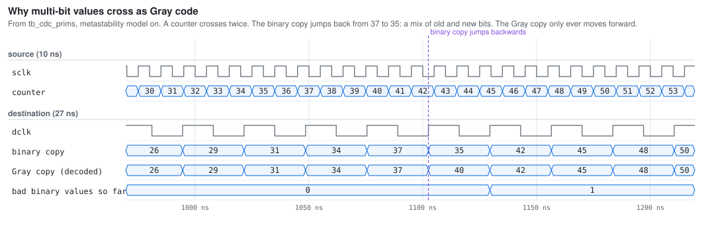

| Encoding | Bad values, model off | Bad values, model on |
|---|---|---|
| Binary | 0 | about 100 per run |
| Gray | 0 | 0 |

With the model off, both look perfect. That is the whole case for Gray-coding
a multi-bit crossing, and for not trusting simulation alone to check CDC.

**A FIFO with binary pointers survives this model**, and it is worth
knowing why. A bad sample can only happen when the other side's pointer
really has moved, which means at least one word or slot really became
available. Each side steps one entry per clock and the next sample is clean,
so a one-cycle bad value can never push it past the real pointer. In this
design Gray pointers make the synchronized value *correct* rather than just
harmless. A design that used the synchronized pointer for more, such as a
fill-level count for burst transfers, would break.

**Getting the model right mattered.** The first version treated every bit
that changed at any time since the last clock edge as uncertain, and it
flagged the Gray copy too. Real metastability only affects a change inside a
tiny window at the edge, and for Gray code only one bit changes there. The
test caught the modelling mistake.

---

## 2. The chip: crossing the bus to the peripherals

| File | What it does |
|---|---|
| [`minisoc_top.v`](rtl/soc/minisoc_top.v) | Top level: core, RAM, counters, bridge, peripherals, two clocks, two resets |
| [`cdc_apb_bridge.v`](rtl/soc/cdc_apb_bridge.v) | The core's data bus to APB, across the clock domains, through two async FIFOs |
| [`tcm.v`](rtl/soc/tcm.v) | 16 KiB RAM with an instruction port and a data port |
| [`perf_counters.v`](rtl/soc/perf_counters.v) | Cycles, fetches, sleep time, and peripheral access count, total and worst latency |
| [`apb_uart_tx.v`](rtl/periph/apb_uart_tx.v) | Transmit-only UART; holds `PREADY` low while busy |
| [`apb_timer.v`](rtl/periph/apb_timer.v) | Timer whose interrupt crosses back to the core's clock |
| [`apb_decoder.v`](rtl/periph/apb_decoder.v) | Routes APB to the peripherals; an unmapped address faults instead of hanging |

Memory map: RAM at `0x0000_0000`, UART at `0x1000_0000`, timer at
`0x1000_1000`, performance counters at `0x2000_0000`, power controller at
`0x3000_0000`.

### One access, end to end

A store from the core to the UART. The request goes into the request FIFO,
crosses to the peripheral clock, the APB master runs SETUP then ACCESS, and
the response crosses back:

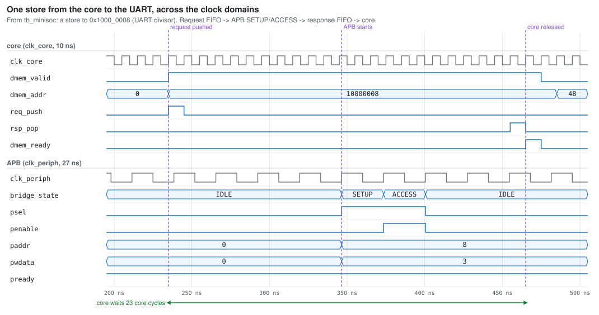

### APB wait states

The second byte is written while the first is still shifting out. The UART
holds `PREADY` low until it is free; the bridge waits, and the core waits
for the bridge. Nothing is dropped:

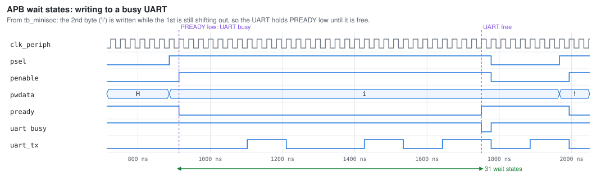

### The interrupt crossing

The timer's interrupt is a level from a flop, so a plain two-flop
synchronizer is enough:

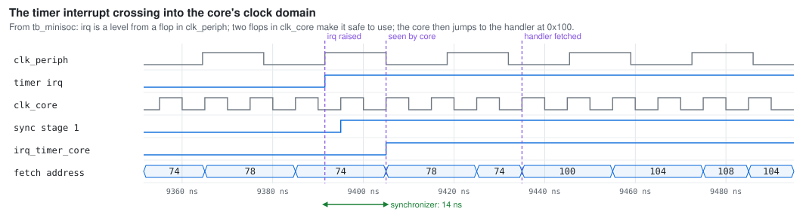

### CDC analysis with Vivado `report_cdc`

[`vivado/cdc_check.tcl`](vivado/cdc_check.tcl) synthesizes the chip for an
Artix-7 and runs Vivado's structural CDC analysis. The first run found two
real problems:

| Finding | Cause | Fix |
|---|---|---|
| 380 critical (CDC-1) | The core read the bridge's response straight out of the FIFO memory, so the fault bit went through the core's stall logic to the enables of hundreds of registers | Register the response in the core's clock domain first, at a cost of one core cycle |
| 1 critical (CDC-10) | The timer's interrupt came from a gate (`pending && irq_en`). A gate's output can glitch, and a synchronizer can catch the glitch as a phantom interrupt | Drive the interrupt from a flop |

After the fixes there are 0 critical findings. The remaining warnings are
the patterns this design is supposed to have, the Gray pointers (CDC-6) and
the FIFO data path (CDC-15). They are waived in
[`constraints/cdc_waivers.tcl`](constraints/cdc_waivers.tcl), each with its
reason, and scoped to the bridge's FIFOs so that a new crossing anywhere
else still gets reported. The reports are in
[`vivado/reports/`](vivado/reports).

The crossings are constrained with `set_max_delay -datapath_only`, not cut
with a false path. A false path would let the tools route one Gray pointer
bit far longer than the others, which is how a correct Gray FIFO still fails
in silicon.

---

## 3. Power domains

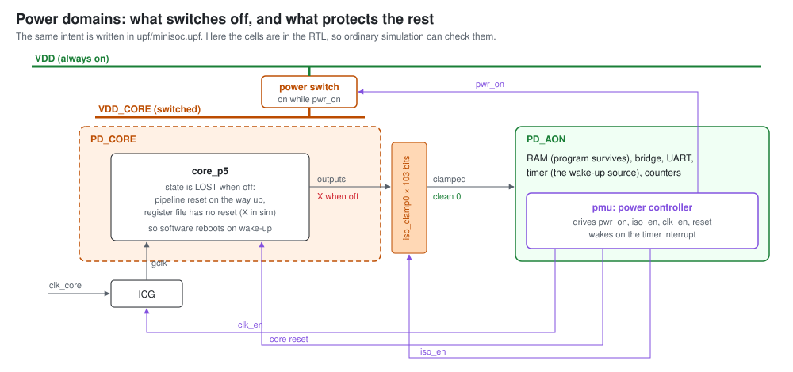

| File | What it does |
|---|---|
| [`pmu.v`](rtl/power/pmu.v) | Power controller: sequences power-down and wake-up, one step per clock |
| [`core_pd.v`](rtl/power/core_pd.v) | The switchable domain: the core, a simulation model of its power switch, and the isolation cells |
| [`icg.v`](rtl/power/icg.v) | Glitch-free clock gate: a latch and an AND gate, as the standard cell does it |
| [`minisoc.upf`](upf/minisoc.upf) | The same power intent in IEEE 1801 (UPF), the format real flows read |

Only the core switches off. The RAM stays on, so the program survives. The
core does not keep its state: it reboots, and reads the power controller's
STATUS register to tell a wake-up from a cold start, as microcontroller
standby modes do.

### The sequence

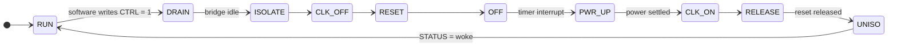

Going down: wait for the bridge to go idle, isolate the outputs, stop the
clock, hold reset, cut the power. Coming up runs in reverse, with one rule
that is easy to get wrong: the clock restarts while reset is still held, so
every flop sees clock edges during reset and starts from its reset value.
Isolation comes off last, once the core is running.

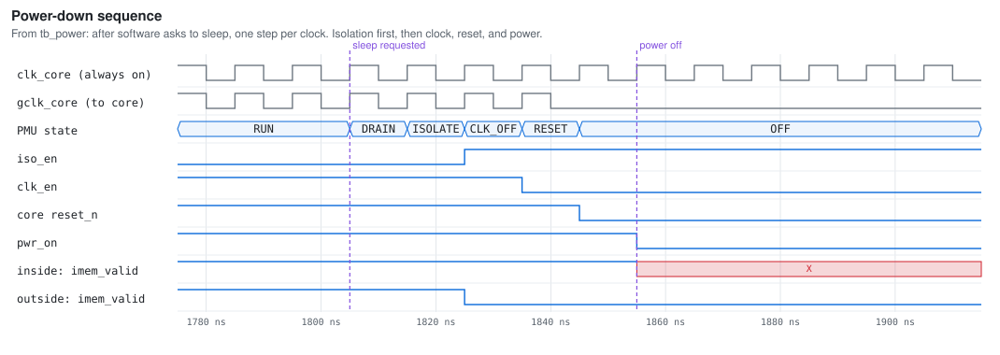

Note the last two rows: inside the domain the core's output goes to X when
the power is cut; outside the isolation cells it is a clean 0 the whole time.

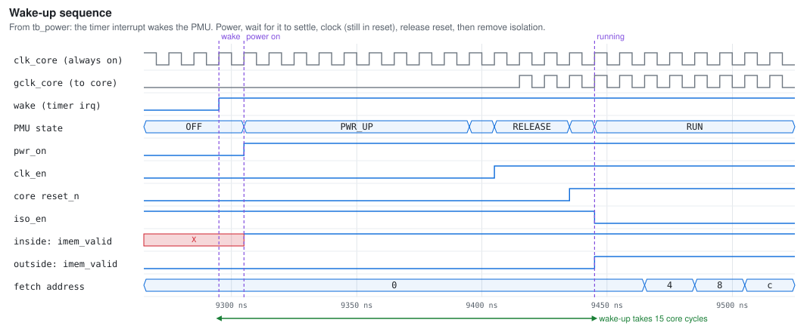

Here the inside signal is already 1 while the core is still held in reset.
That is why isolation stays on until after reset is released.

### Power-aware simulation without a power-aware simulator

Vivado cannot read UPF, so `core_pd.v` models the effect of switching off,
in simulation only: while the power is off every output of the domain is X,
and at power-down the register file, which has no reset, is filled with X.
If isolation is missing or late, the X escapes into the always-on logic and
the test catches it.

The test program prints `S`, sets the timer and asks to sleep. The timer
wakes the core, which reboots, takes the wake-up path and prints `W`. With a
10 ns core clock and a 27 ns peripheral clock, the core's clock is stopped
for 757 of 1,070 cycles.

Two broken power controllers, to show the test can fail:

| Broken power controller | Result |
|---|---|
| Never turns isolation on | X escapes on 745 cycles, and the program never finishes |
| Cuts the power in the same cycle as isolation | **The program still runs correctly.** Only the ordering assertions catch it (4 violations) |

The second row is why the sequencing rules are assertions. The functional
result is right; the bug is a one-cycle race that, in silicon, could let a
glitch out of a dying domain.

---

## 4. How it is verified

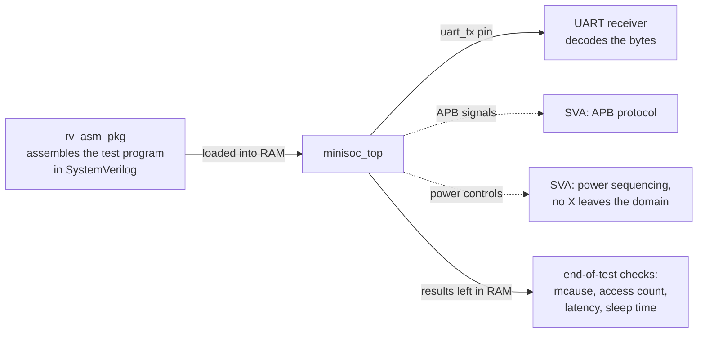

| Testbench | What it checks |
|---|---|
| [`tb_async_fifo.sv`](dv/tb_async_fifo.sv) | Scoreboard (every word once, in order); assertions (pointers change one bit per clock; no pointer movement on a write when full or a read when empty); coverage (full and empty reached, set and cleared); crossing latency. Three clock ratios, and once with the metastability model on |
| [`tb_cdc_prims.sv`](dv/tb_cdc_prims.sv) | Binary versus Gray counter crossing; every pulse through `pulse_sync` arrives exactly once and is one cycle wide; `rst_sync` asserts with no clock and releases on exactly the second edge |
| [`tb_minisoc.sv`](dv/tb_minisoc.sv) | The whole chip runs a program: UART output, timer, an interrupt across the clock domains, performance counters. APB protocol assertions every cycle. Exactly 12 peripheral accesses, so a spurious second interrupt fails it |
| [`tb_power.sv`](dv/tb_power.sv) | Sleep and wake-up. Isolation, stopped clock and reset whenever power is off; isolation on before power off and off only after reset; nothing unknown ever leaves the core's domain; the register file really was lost |

Principles used throughout:

- **A test passes only on its own PASS line**, never on the simulator's exit
  code, which is 0 even after a testbench reports errors.
- **Tests are run against broken RTL**, to show they fail when they
  should: a binary counter crossing (caught by `tb_cdc_prims`), isolation
  missing and the power cut in the wrong cycle (both caught by `tb_power`),
  and in TinyTrust the pipeline with forwarding, stall or flush removed.
  One experiment did *not* fail, and is described in section 1: a FIFO with
  binary pointers.
- **Coverage is a pass condition.** A FIFO test that never filled the FIFO
  has not tested the full flag, however many words it moved.
- **No compiler needed.** Test programs are written as SystemVerilog calls
  (`emit(ADDI(6, 0, 3))`) and loaded straight into RAM.

---

## 5. Results

**Latency of one access from the core to the peripheral domain**, measured
by the hardware performance counters (core clock 10 ns):

| Peripheral clock | Average | Longest (UART busy) |
|---|---|---|
| 27 ns, slower than the core | 37.7 core cycles | 108 |
| 10.37 ns, about equal | 16.8 | 40 |
| 7 ns, faster | 12.6 | 26 |

**FIFO crossing latency**, write accepted to word read: 3 to 4 read clocks
at every clock ratio.

**Wake-up**, from the timer interrupt to the core running: 15 core cycles.

**FPGA stand-in** (Artix-7 xc7a35t, after synthesis; estimates, not after
place-and-route):

| | |
|---|---|
| LUTs | 2,162 (10%) |
| Flip-flops | 1,324 (3%) |
| Block RAM | 4 tiles (the 16 KiB RAM) |
| Core clock | 15 ns (66.7 MHz), 1.57 ns to spare. At 10 ns it misses by about 3 ns: the core was tuned for the ASIC flow, and an FPGA LUT is slower than a standard cell |
| Crossings | Meet their 15 ns bound with 13.3 ns to spare |

---

## 6. Running it

Needs Vivado 2021.1 (the free edition is enough). Commands are for
PowerShell on Windows.

```powershell
.\scripts\run_sim.ps1                     # all 11 tests, pass/fail and numbers
.\scripts\run_sim.ps1 power_pslow -Gui    # one test, straight into the waveform viewer
python scripts\make_waves.py              # redraw every waveform in docs/waves/
cd vivado; vivado -mode batch -source cdc_check.tcl   # synthesis and report_cdc
```

Or in the Vivado GUI:

```powershell
cd vivado; vivado -mode batch -source create_project.tcl   # then open vivado\proj\minisoc.xpr
```

In the Sources panel, right-click a simulation set, choose **Make Active**,
then click **Run Behavioral Simulation**. No synthesis is needed.
`sim_minisoc`, `sim_power` and `sim_async_fifo` open with their waveforms
already laid out.

---

## 7. What this does not claim

- **The UPF file is not checked by a tool.** No free UPF-aware simulator or
  checker exists; the real ones are Synopsys VCS NLP, Siemens Questa PA and
  Cadence Conformal Low Power. The behaviour it describes *is* checked, in
  RTL simulation, through the power model in `core_pd.v`.
- **The isolation cells are written in the RTL by hand**, so that ordinary
  simulation exercises them. In a full flow, synthesis inserts them from the
  UPF.
- **`report_cdc` is structural CDC checking**, the kind Vivado does. It is not
  the formal CDC signoff of tools like Synopsys SpyGlass or Siemens Questa CDC.
- **The FPGA numbers are after synthesis only**, and the FPGA is a stand-in:
  minisoc is not built for a board. Synthesis gives one warning, "inferring
  latch", on the clock gate. That latch is what makes the gate glitch-free;
  on an FPGA the right cell is a BUFGCE.
- **The core is reused, not new.** It comes from TinyTrust, where it is
  verified against an instruction set simulator and by riscv-formal.

---

## Repository layout

```
minisoc/
├── rtl/
│   ├── core/         the CPU, reused as IP (core_p5, regfile, pmp)
│   ├── cdc/          sync_2ff, rst_sync, pulse_sync, async_fifo
│   ├── soc/          minisoc_top, cdc_apb_bridge, tcm, perf_counters
│   ├── periph/       apb_uart_tx, apb_timer, apb_decoder
│   └── power/        pmu, core_pd (+ iso_clamp0), icg
├── dv/               testbenches (.sv) and waveform layouts (waves_*.tcl)
│   └── common/       rv_asm_pkg: writes test programs in SystemVerilog
├── upf/              minisoc.upf, the power intent
├── constraints/      minisoc.xdc (clocks, crossings), cdc_waivers.tcl
├── vivado/           create_project.tcl, cdc_check.tcl, reports/
├── scripts/          run_sim.ps1 (regression), make_waves.py (figures)
└── docs/
    ├── diagrams/     block diagrams (SVG)
    └── waves/        waveforms drawn from the simulations (SVG)
```

## License

Apache 2.0, see [LICENSE](LICENSE).
